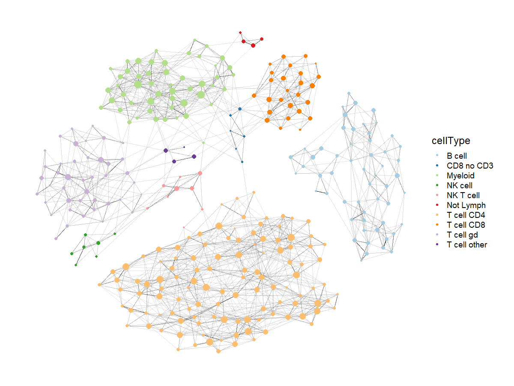

# HiTMapper

## Installation
It's easiest to install HiTMapper with the help of the `devtools` package.

`install.packages("devtools") # if necessary`  
`devtools::install_github("matei-ionita/HiTMapper")`

## Summary
Mapper is an algorithm developed for topological data analysis, originally due to [[1]](#1). It constructs a graph which approximates the (hypothetical) landscape from which data points are sampled. HiTMapper is an implementation which is tailored to cytometry data: for example, only using subroutines that run in linear time, so that millions of data points can be processed in a few minutes.

Each node in the Mapper graph represents multiple data points, resulting in a compact visualization of the dataset. Crucially, the nodes are fine-grained, not meant to represent distinct phenotypes, but rather subtly different cell states. This enables the visualization of hundreds of detailed cell states in a relational framework. We can also use the graph to provide a warm start for traditional clustering, using the Leiden method[[2]](#2) for community detection.

## References
<a id="1">[1]</a> 
Singh, Gurjeet, Facundo Mémoli, and Gunnar E. Carlsson. "Topological methods for the analysis of high dimensional data sets and 3d object recognition." SPBG 91 (2007): 100.

<a id="2">[2]</a> 
Traag, Vincent A., Ludo Waltman, and Nees Jan Van Eck. "From Louvain to Leiden: guaranteeing well-connected communities." Scientific reports 9.1 (2019): 1-12.
